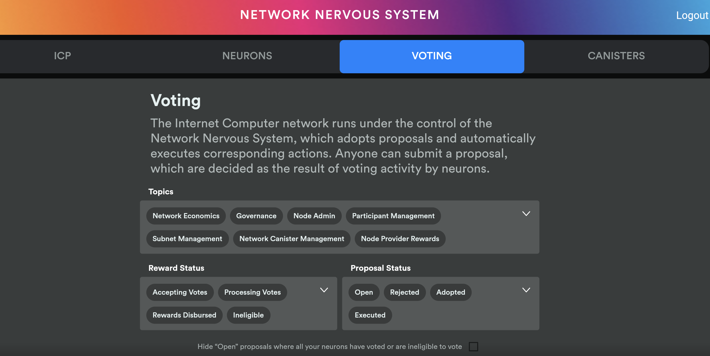

# Network Nervous System Dapp

The [NNS front-end Dapp](https://nns.ic0.app/) is a dapp that provides a user friendly way to interact with the NNS of the Internet Computer. With it, you can:

* Send/receive ICP
* Stake neurons
* Create canisters
* Top up canisters with cycles
* View and vote on NNS proposals

### Additional resources
* [The Network Nervous System: Governing the Internet Computer](https://medium.com/dfinity/the-network-nervous-system-governing-the-internet-computer-1d176605d66a)
* [The Internet Computer’s NNS Front-End Dapp Is Now Open Source](https://medium.com/dfinity/the-internet-computers-nns-front-end-dapp-is-now-open-source-3925edc21c49)
* [How to Deploy Your First Canister Smart Contract Using the NNS Dapp](https://medium.com/dfinity/how-to-deploy-your-first-canister-using-the-nns-dapp-c8b75e01a05b)
* [The Community-Led Governance of the Internet Computer](https://medium.com/dfinity/the-community-led-governance-of-the-internet-computer-b863cd2975ba)
* [Earn Substantial Voting Rewards by Staking in the Network Nervous System](https://medium.com/dfinity/earn-substantial-voting-rewards-by-staking-in-the-network-nervous-system-7eb5cf988182)
* [Get Started Using the NNS Front-End Dapp and ICP Wallet on the Internet Computer](https://medium.com/dfinity/getting-started-on-the-internet-computers-network-nervous-system-app-wallet-61ecf111ea11)

### What it looks like 

## Official build

The official build should ideally be reproducible, so that independent parties
can validate that we really deploy what we claim to deploy.

We try to achieve some level of reproducibility using a Dockerized build
environment. The following steps _should_ build the official Wasm image

    ./scripts/docker-build
    sha256sum nns-dapp.wasm

The resulting `nns-dapp.wasm` is ready for deployment as
`qoctq-giaaa-aaaaa-aaaea-cai`, which is the reserved principal for this service.

Our CI also performs these steps; you can compare the SHA256 with the output there, or download the artifact there.

## Development

Development relies on the presence of a testnet that is setup with the II, governance, ledger, and cycle minting canisters. Fully local development is unfortunately not yet supported and the tools for setting up a testnet are not yet available publicly. It is on the roadmap to make these tools available publicly for developers.

When deploying the governance, ledger, and cycle minting canisters to the testnet you must first create a file called `test-accounts.json` in the root of the IC repo whose contents is:

    {"init_ledger_accounts":["5b315d2f6702cb3a27d826161797d7b2c2e131cd312aece51d4d5574d1247087"]}

Then run the following from the root directory of the IC repo:

    ./testnet/tools/icos_deploy.sh --git-revision <commit_id> nnsdapp --ansible-args "-e @$PWD/test-accounts.json"

To deploy the NNS Dapp canister to the testnet, run the following:

    ./deploy.sh testnet

You can now access the frontend using:

    open "https://$(dfx canister --network testnet id nns-dapp).nnsdapp.dfinity.network"

To work on the UI locally, either use your IDE, or run the following:

    cd frontend/dart
    flutter run --no-sound-null-safety --dart-define=DEPLOY_ENV=staging --web-port 5021

## Environment variables

### `REDIRECT_TO_LEGACY`

This environment varibale controls whether the svelte or flutter implementation will be available.

| `REDIRECT_` | Login     | Accounts tab | Neurons tab | Proposals tab | Canisters tab |
| `TO_LEGACY` | page      |              |             |               |               |
|-------------|-----------|--------------|-------------|---------------|---------------|
| prod        | svelte    | flutter      | flutter     | flutter       | flutter       |
| staging     | svelte    | flutter      | flutter     | svelte        | flutter       |
| svelte      | svelte    | svelte       | svelte      | svelte        | svelte        |
| flutter     | svelte    | flutter      | flutter     | flutter       | flutter       |
| both        | svelte    | both         | both        | both          | both          |
